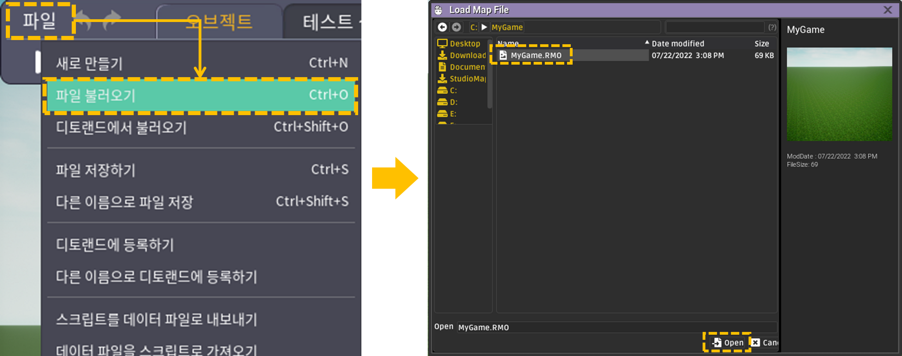
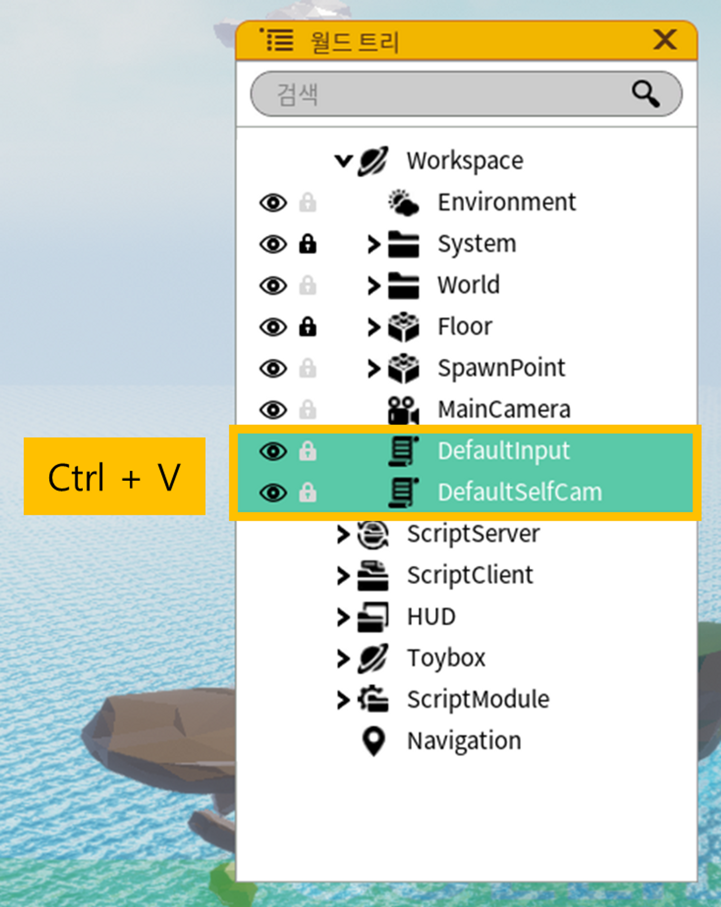
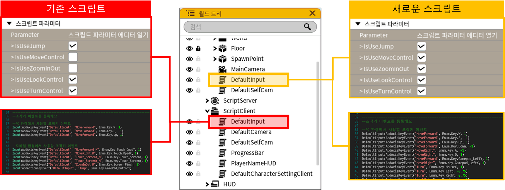
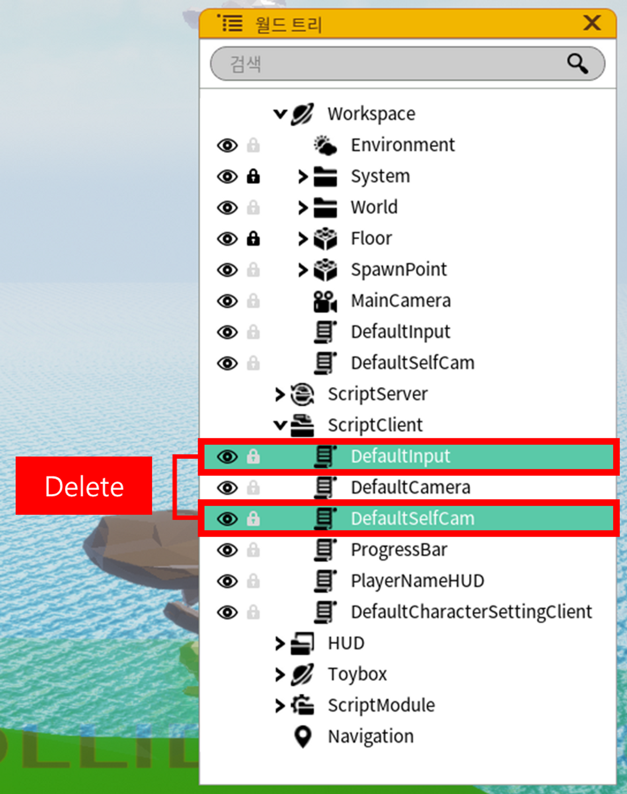
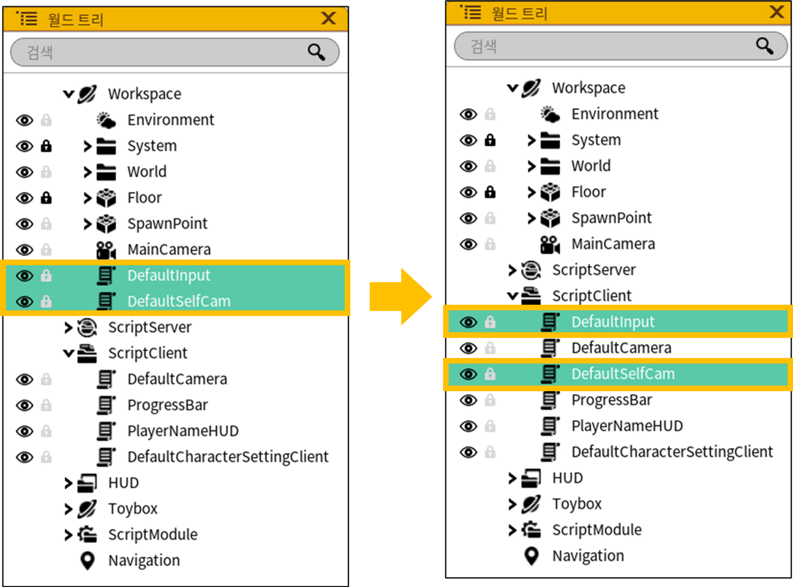

# M8 스크립트 변경점66666

## 기존 맵 파일 최신화 방법

1. 스튜디오를 실행하고 Blank 맵을 생성해주세요.

    <figure><figcaption></figcaption></figure>


2. Blank 맵에서 아래와 같은 오브젝트들을 선택한 뒤, 복사해주세요. **( Ctrl + C )**

     <figure><figcaption></figcaption></figure>

3. 이전 버전에서 작업했던 맵 파일을 열어주세요.

     <figure><figcaption></figcaption></figure>


4. Blank 맵에서 복사한 오브젝트들을 붙여넣기 해주세요. **( Ctrl + V )**

<figure><figcaption></figcaption></figure>

5. **기존에 있던 스크립트**를 확인 후, **새로 붙여넣기 한 스크립트**에 옮겨야 하는 부분이 있다면 적용해주세요.

<figure><figcaption></figcaption></figure>

6. 모두 적용했다면, **기존에 있던 스크립트**를 삭제해주세요.

<figure><figcaption></figcaption></figure>

7. **새로 붙여넣기 한 스크립트**의 위치를 아래와 같이 수정해주세요.

<figure><figcaption></figcaption></figure>

---

## 스크립트 변경 사항

### 1. 조작 그룹

조작 그룹의 구조가 기존과 다르게 변경되었어요.

아래 변경 사항을 확인하신 후, 조작 그룹을 사용하는 곳이 있다면 수정해주세요. ✏

- 조작 그룹 및 이벤트 추가 함수

| 기존 | 변경 |
| --- | --- |
| Input:AddGroup("DefaultInput") | DefaultInput = Input:AddGroup("DefaultInput") |
| Input:AddAxisKeyEvent("DefaultInput", "MoveForward", .. ) | DefaultInput:AddAxisKeyEvent("MoveForward", .. ) |
| Input:AddActionKeyEvent("DefaultInput", "Jump", .. ) | DefaultInput:AddActionKeyEvent("Jump", .. ) |

- 키 이벤트 연결 함수

| 기존 | 변경 |
| --- | --- |
| LocalPlayer:ProcessInputAxisEvent( .. ) | DefaultInput:ProcessInputAxisEvent( .. ) |
| LocalPlayer:ProcessInputActionEvent( .. ) | DefaultInput:ProcessInputActionEvent( .. ) |
| LocalPlayer:ProcessTouchAxisEvent( .. ) | DefaultInput:ProcessTouchAxisEvent( .. ) |
| LocalPlayer:ProcessTouchActionEvent( .. ) | DefaultInput:ProcessTouchActionEvent( .. ) |

- 조작 이벤트 제거 함수

| 기존 | 변경 |
| --- | --- |
| Input:RemoveActionKeyEvent("DefaultInput", "Jump", .. ) | DefaultInput:RemoveActionKeyEvent("Jump", .. ) |
| Input:RemoveAxisKeyEvent("DefaultInput", "Turn", .. ) | DefaultInput:RemoveAxisKeyEvent("Turn", ..) |

### 2. 리더보드

 

<figure><figcaption></figcaption></figure>

**게임 통계 데이터** 객체를 생성할 수 있는 함수가 추가되었어요. ✨

이에 따라, 기존 리더보드 함수에서 **저장소 키 이름**을 작성했던 인자에, 
**게임 통계 데이터** 객체를 작성하도록 변경되었어요. 🔧

| 함수 이름 | 기존 인자 | 변경된 인자 |
| --- | --- | --- |
| NewGameStatisticsData | (게임 통계 데이터 객체를 생성하는 함수가 추가되었습니다) | 저장소 키 이름, 오름차순 정렬 여부, 덮어쓰기 여부 |
| GetGameStatisticsData | 저장소 키 이름, 덮어쓰기 여부, Offset 값, Count 값, 연결 함수 | 게임 통계 데이터, Offset 값, Count 값, 연결 함수 |
| SaveGameStatisticsData | PlayerID, 저장소 키 이름, 저장할 데이터, 덮어쓰기 여부, 오름차순 정렬 여부 | PlayerID, 게임 통계 데이터, 저장할 데이터 |
| SendToClient_GameStatisticsData | PlayerID, 저장소 키 이름, 오름차순 정렬 여부, Offset 값, Count 값 | PlayerID, 게임 통계 데이터, Offset 값, Count 값 |
| Broadcast_GameStatisticsData | 저장소 키 이름, 오름차순 정렬 여부, Offset 값, Count 값 | 게임 통계 데이터, Offset 값, Count 값 |

❕ 아래에서 리더보드 함수의 사용 예시를 확인해주세요. 😀

- **NewGameStatisticsData** (string KeyString, bool Ascending, bool Overwrite)
    
    ```lua
    local SaveKeyName = "LeaderBoard2022" --저장소 키 이름이에요.
    local LeaderBoardData = nil           --게임 통계 데이터를 저장할 변수에요.
    
    --게임 통계 데이터 객체를 만들어요. (저장소 키 이름, 오름차순 정렬 여부, 덮어쓰기 여부)
    LeaderBoardData = Game:NewGameStatisticsData(SaveKeyName, true, true)
    ```
    
- **GetGameStatisticsData** (GameStatisticsData Data, number Offset, number Count, function CallBackFunction)
    
    ```lua
    local LeaderBoard = {} --리더보드 테이블이에요.
    
    --얻은 데이터를 리더보드 테이블에 저장해요.
    local function CompleteAquireData(count, data)
        for i = 1, count do            
            LeaderBoard[data[i].PlayerID] = data[i].Value
        end
    end
    
    --LeaderBoardData 객체에 해당하는 데이터를 얻을 수 있어요. (게임 통계 데이터, Offset 값, Count 값, 연결 함수)
    Game:GetGameStatisticsData(LeaderBoardData, 0, 10, CompleteAquireData)
    ```
    
- **SaveGameStatisticsData** (number PlayerID, GameStatisticsData Data, number SaveValue)
    
    ```lua
    function AddLeaderBoard(player, saveValue)   
        --특정 유저의 게임 통계 데이터를 저장할 수 있어요. (PlayerID, 게임 통계 데이터, 저장할 데이터)
        Game:SaveGameStatisticsData(player:GetPlayerID(), LeaderBoardData, saveValue)
    end
    ```
    
- **SendToClient_GameStatisticsData** (number PlayerID, GameStatisticsData Data, number Offset, number Count)
    
    ```lua
    local function RefreshLeaderboard()		
        local playerList = Game:GetAllPlayer()
        
        for i = 1, #playerList do 
    				--특정 플레이어의 클라이언트에 리더보드 데이터를 보낼 수 있어요. (PlayerID, 게임 통계 데이터, Offset 값, Count 값)
            Game:SendToClient_GameStatisticsData**(**playerList[i], LeaderBoardData, 0, 10)
        end
    end
    ```
    
- **Broadcast_GameStatisticsData** (GameStatisticsData Data, number Offset, number Count)
    
    ```lua
    local function RefreshAllPlayer()      
        --모든 플레이어의 클라이언트에 리더보드 데이터를 보낼 수 있어요. (게임 통계 데이터, Offset 값, Count 값)
        Game:Broadcast_GameStatisticsData(LeaderBoardData, 0, 10)
    end
    ```
    

자세한 활용 방법은 CrossJump 템플릿에 있는 리더보드 스크립트를 참고해주세요. 🐸

<figure><figcaption></figcaption></figure>
