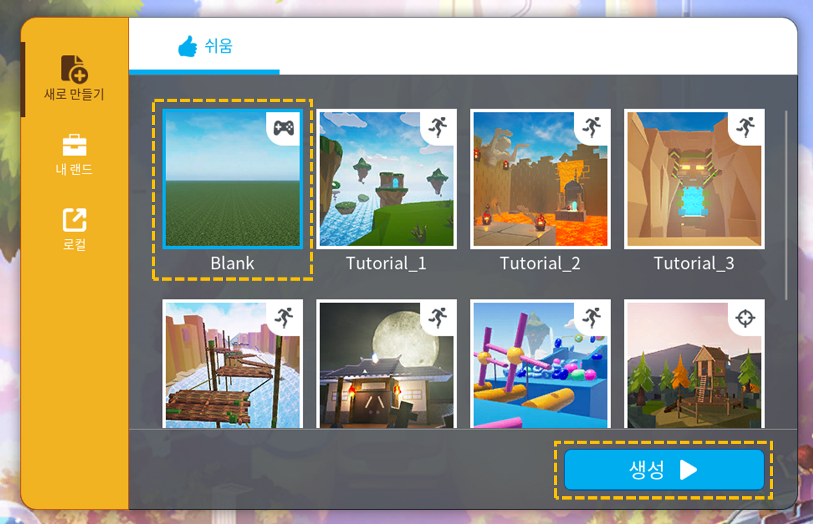
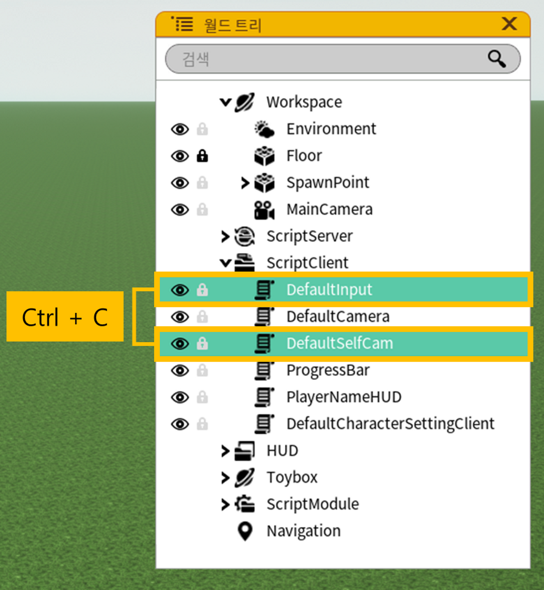

## 기존 맵 파일 최신화 방법

1. 스튜디오를 실행하고 Blank 맵을 생성해주세요.
    
    <figure><figcaption></figcaption></figure>
    
2. Blank 맵에서 아래와 같은 오브젝트들을 선택한 뒤, 복사해주세요. **( Ctrl + C )**
    
    <figure><figcaption></figcaption></figure>
