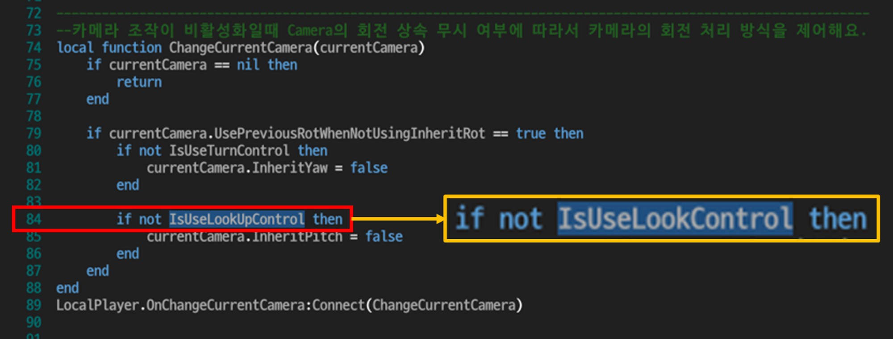
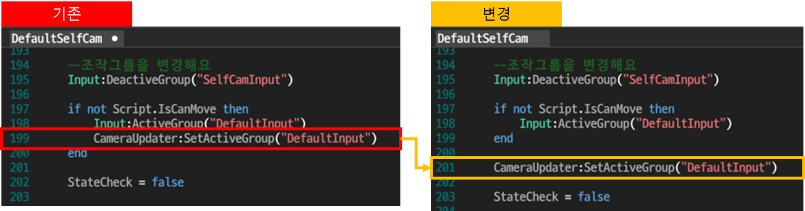
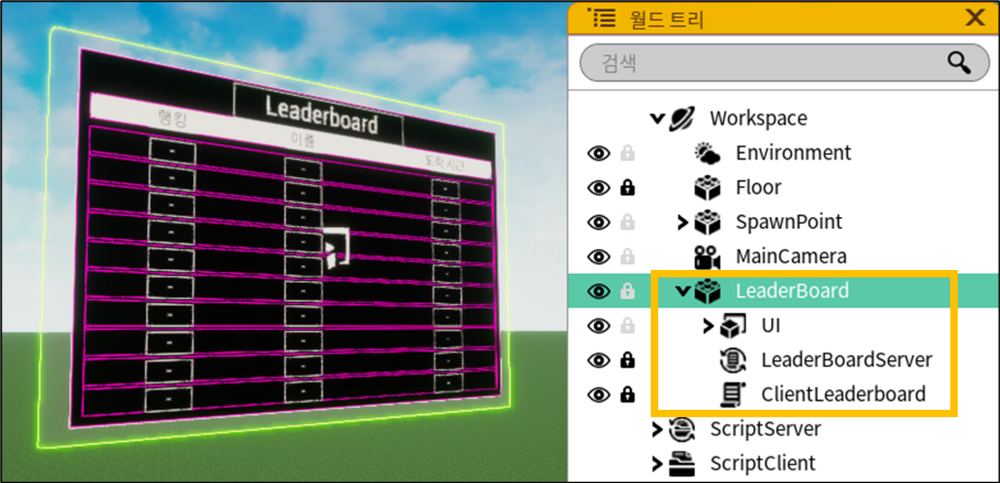

# M9 변경점 메뉴얼

수정 내용을 추가했어요\~\~\~\~===========================================

수정 내용을 추가했어요\~\~\~============================================

####

#### 기본 스크립트 수정 사항

아래 내용대로 기본 제공되는 스크립트를 수정해주세요. 📄

*   **DefaultInput 스크립트**의 84번째 줄

    ⚠ 변수 이름이 잘못 작성되어 있어요.

    ✏ **IsUseLookUpControl** 을 **IsUseLookControl** 로 수정해주세요.

<figure><figcaption></figcaption></figure>


*   **DefaultSelfCam 스크립트** 199번 줄

    ⚠ 코드의 위치가 잘못되었어요.

    ✏ 199번째 줄 코드의 위치를 if문 외부로 변경해주세요.

<figure><figcaption></figcaption></figure>

***

#### 리더보드 함수 수정 사항

<figure><figcaption></figcaption></figure>

⚠ GetGameStatisticsData 함수에서, CallBack 연결 함수의 첫번째 인자인 **count 인자**가 **삭제**되었어요.

```lua
local function CompleteAquireData(**count**, data) -- !! count 인자 삭제
	...
end

--게임 통계 데이터를 얻을 수 있어요. (GameStatisticsData, Offset 값, Count 값, CallBack 연결 함수)
Game:GetGameStatisticsData(LeaderBoardData, 0, 10, CompleteAquireData)
```

✏ 리더보드 데이터의 개수는, count 인자 대신 **data 인자의 개수(#data)** 로 받아올 수 있어요.

아래 코드를 참고하여, 리더보드의 Server 스크립트를 수정해주세요.

```lua
--게임 통계 데이터를 리더보드 테이블에 저장해요.
local function CompleteAquireData(data)                          -- count 인자 삭제
    --print("CompleteAquireData Total data count : " .. #data)   -- count 인자 대신 #data 사용 
    for i = 1, #data do                                          -- count 인자 대신 #data 사용 
        LeaderBoard[data[i].PlayerID] = data[i].Value
    end
end

wait(3)

--게임 통계 데이터를 얻을 수 있어요. (GameStatisticsData, Offset 값, Count 값, CallBack 연결 함수)
Game:GetGameStatisticsData(LeaderBoardData, 0, 10, CompleteAquireData)
```
